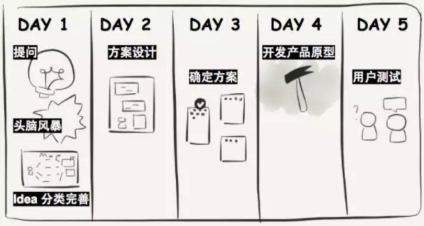

在互联网产品

一个新产品的研发和生产，需要耗费 18 个月的时间和几百万美元的费用。怎么在研发开始的阶段，就确定我们要做的是正确的事情？

没有什么问题是大到不能用设计冲刺来解决的。

第一，设计冲刺逼着你和团队，专注解决最紧迫的问题。在仅有一周的时间里，你不可能一次性解决所有的问题。这样可以确保你们取得进展。

第二，设计冲刺，让你可以通过一个成品的外观，获得更加真实的反馈。

## 相关阅读

- [轻芒杂志是这样用 5 天时间做出来的](https://mp.weixin.qq.com/s?__biz=MzIxMDYxOTIzMQ==&mid=2247483694&idx=1&sn=9ce30cfc2f086e77468ecd65f6ec9251&chksm=97609f1ea0171608fbe4fa8a0819a5cf727d03a3423da14c7e8d43f7d85af4b0f1646ca87b41#rd)
-
